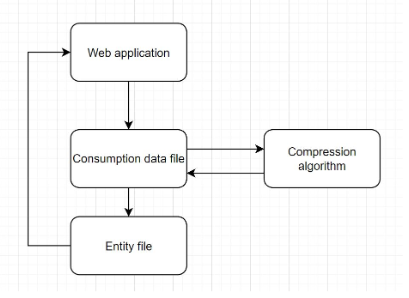
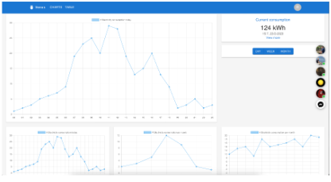

# Venus
A program to Visulize data from smart plugs.

## Demo link:
No current link.

## Table of Content:

- [About The App](#about-the-app)
- [Screenshots](#screenshots)
- [Technologies](#technologies)
- [Setup](#setup)
- [Approach](#approach)
- [Status](#status)
- [Credits](#credits)
- [License](#license)

## About The App
Venus is a program that takes a csv file as input and vizulises the data from it.

## Screenshots

## Technologies
We used `html`, `css`, `js` and `React`

## Setup
- download or clone the repository
- run `npm install`
- run `npm start`
- goto http://localhost:3000 on your favorite browser

